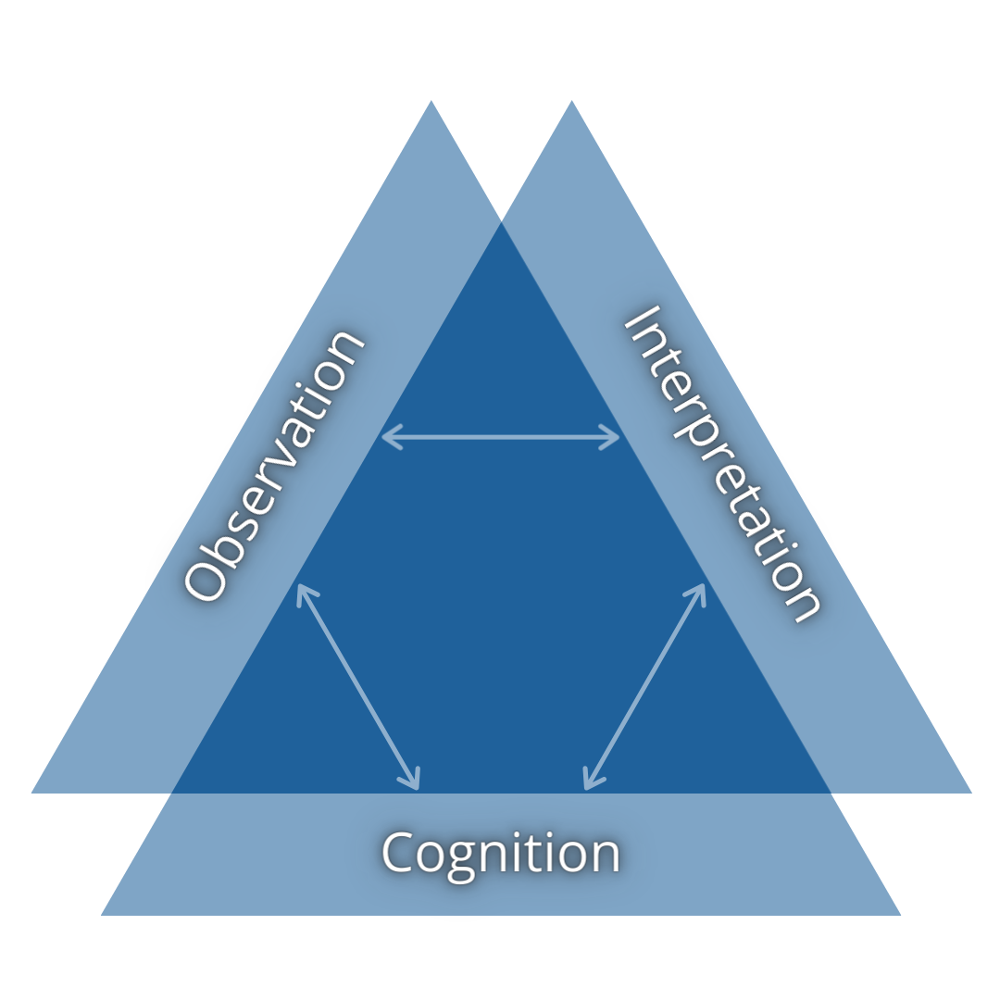

Pellegrino, J. W., Chudowsky, N., & Glaser, R. (2001). *Knowing What Students Know: The Science and Design of Educational Assessment.* National Academies Press. https://doi.org/10.17226/10019

 #assessment.assessment-triangle #assessment.context-dependent #reasoning #evidence #assessment.alignment

---

## Assessment Triangle

The NRC models assessment as a triangle composed of three interdependent components of any assessment (Figuintro):  *cognition*, or a model of the domain to be learned; *observation*, or the performance task learners will complete to demonstrate their competence; and an *inference* or *interpretation* of the data produced by the observation. The interdependent nature of the three components requires that both the observation and interpretation components be grounded in the nature of the cognitive model of the domain. For example, if the domain of knowledge is, broadly speaking, statistics, then the observation, or performance task, must elicit responses which require the examinee to demonstrate competence in statistics [@gerritsen-vanleeuwenkampAssessmentQualityTertiary2017]. If the performance task requires the ability to speak Icelandic, a different cognitive domain, then a Swahili-speaking examinee's responses will not be representative of their ability in statistics, but rather their lack of ability to speak Icelandic. Consequently, the examiner will have no basis for making an inference about the examinee's statistical ability; in other terms, the inference would be invalid because the performance task is not aligned with the cognitive model (see also [@biggsWhatStudentDoes1999]). [[assessment.foundation.biggsWhatStudentDoes1999]]

### Cognition

### Observation

### Interpretation

### p 25

> This evolutionary process is described in more detail in Chapters 3 and 4. As Mislevy (1993, p. 19) has noted, “It is only a slight exaggeration to describe the test theory that dominates educational measurement today as the application of 20th century statistics to 19th century psychology.” Although the core concepts of prior theories and models are still useful for certain purposes, they need to be augmented or supplanted to deal with newer assessment needs.

### p43 

> reasoning from evidence

### p112
> a process of drawing reasonable inferences about what students know on the basis of evidence derived from observations of what they say, do, or make in selected situations 

